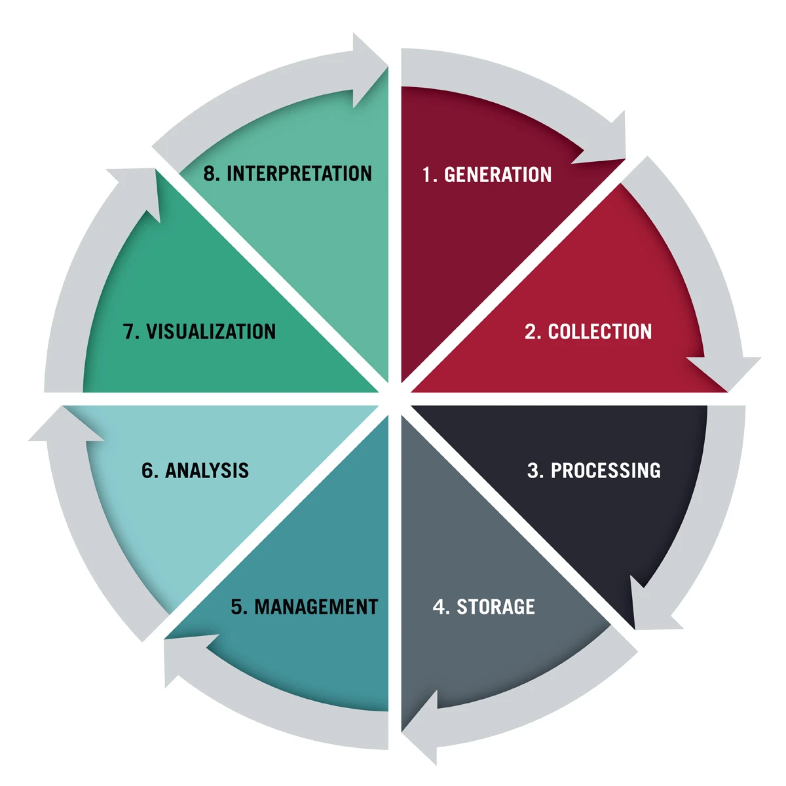

# iFp Python Coding Practice: Data Analysis with Python

Welcome to iFp's Python coding practice 3! In this session you will practice Python by analyzing and visualizing the dataset of "Social Media Impact of Life."

## What you'll do
- Build your own version of `my-data-analysis.py`
- Load and explore a CSV dataset with information of 4,500 students
- Filter, sort, count, and group data to answer questions
- Investigate patterns in the data
- Create your own data analysis!

## What you'll learn

Work on this project will help you to:

- Improve your Python programming skills
- Understand how Python can be used for data analysis
- Work with CSV files using `pandas` library
- Create visualizations using `matplotlib` library
- Learn what data can show us and what it can't

This tutorial is part of the **Data Analysis and AI with Python** iFp curriculum.

## Before start coding

We need to make sure we have the following install in our computer:

### Step 1: Install Python

Download and install [Python](https://www.python.org/downloads/) on your computer. 

After installing Python, open your VS Code terminal and check that it works:

`python3 --version`

You should see a Python version number.

### Step 2: Install pandas

Pandas is the Python library we will use for data manipulation.

In the same VS Code terminal:

`python3 -m pip install pandas`


### Step 3: Install matplotlib

Matplotlib is the Python library we will use to turn our data into graphs and visualizations.

In the same VS Code terminal:

`python3 -m pip install matplotlib`

### **OPTIONAL** Step 4: Install Rainbow CSV in Visual Studio Code

Go to VS Code and click on the extensions tab. Install the Rainbow CSV extension. This extension give different colors to the colums in our CSV file.


## Start coding!

Navigate to Visual Studio Code in your applications and clone the `iFp Summer Coding Practice folder` from the iFp Github repository. Open the `PyGame` folder and then the`Data-Analysis-Tutorial` folder. You should be able to see the following files:

- `data-analysis-tutorial.py`: The provided reference sample. This file will contain the structure and behavior of your data analysis.

- `PyREADMEDataAnalysis.md` : You are reading the file right now! This file contains the tutorial instructions. 

- `social_media_impact.csv` : The Dataset we will work with!

Open `data-analysis-tutorial.py` in VS Code and look through the example.

Then create a new file in the same folder named:

```python
my-data-analysis.py
```

### `my-data-analysis.py`

Your `my-data-analysis.py` file will contain the code you write throughout this tutorial.

You will organize your program into:

1. Imports
2. Loading the dataset
3. Exploring the dataset
4. Cleaning/checking the data
5. Filtering and sorting
6. Counting and grouping
7. Data visualization
8. Your own analysis


### `social_media_impact.csv`

This is the dataset we will work with during the whole tutorial. This dataset was obtained from [Kaggle](https://www.kaggle.com/), a platform where anyone around the world can upload and download datasets from diverse topics.

The dataset we are using is called [**Impact of Social Media on Life**](https://www.kaggle.com/datasets/harishyadav0506/impact-of-social-media-on-life) 

**Here is the description of the dataset:** In recent years, the intersection of digital platform consumption, sleep hygiene, and stress has become a critical focus of behavioral and educational research. This dataset provides granular survey metrics across 4,500 students ranging from high school to postgraduate programs to analyze how digital engagement shapes daily life and well-being.

In the following steps we will explore more and more the dataset.


## Imports

In our new file `my-data-analysis.py` write the following code at the top:

```python
import pandas as pd
import matplotlib.pyplot as plt
```

`import` allows us to use code from a Python library in our program. We are assigning `pandas` the shorter name `pd` and `matplotlib` the shorter name `plt`. In the world of programming, this shorter names are called aliases.

Later, when we want to use something from pandas, we can write:

`pd.NAME_OF_PANDAS_FUNCTION`

For example: `pd.read_csv()`

And when we want to use something from matplotlib, we can write:

`plt.NAME_OF_MATPLOTLIB_FUNCTION`

For example: `plt.show()`

We will show you how to work with this in the following steps!

## Exploratory Data Analysis (EDA)

Exploratory data analysis (EDA) is used by data scientists to analyze and investigate datasets and summarize their main characteristics, often employing data visualization methods.

In the following image you can see the steps for EDA based on Harvard School of Business:



Since our dataset `social_media_impact.csv` was download from the web the following steps were already done:

1. Generation: Created a form with questions about the social media impact in students life
2. Collection: Send the form to 4,500 students
3. Processing: Get 4,500 answers
4. Storage: Save the answers in a CSV file

In this tutorial we are going to work on the following steps:

5. Management: Load the dataset and play with it!
6. Analyzing: We are going to understand what the collected data is telling us
7. Visualization: We are going display the data with graphs 
8. Interpretation: We are going to see what the graphs are telling us

## Data Analysis Part 1: Loading our dataset

Before we can manage and analyze data, we need to load it into Python.

### What is a CSV?

CSV stans for **Comma-Separated Values**

A CSV file is a common way to store data in a table.

For example, a very small CSV can look like this:

```text
Name,Age,Favorite Color
Alex,16,Blue
Sam,17,Green
Jordan,16,Red
```

Each row represents one student, and each column represents a piece of information about that student. Our dataset is much larger. It contains information of **4,500 students**.

### Read our CSV file

Make sure `social_media_impact.csv` is in the same folder as `my-data-analysis.py`.

In our `my-data-analysis.py` add the following code:

```python
df = pd.read_csv("social_media_impact.csv")
```

We are using `pd.read_csv()` to read the CSV file. We are storing the dataset in a variable called `df`.

`df` is a common abbreviation for **DataFrame**. A pandas DataFrame is like a table that Python can work with.

### Print the dataset

Let's see what our DataFrame looks like. Add the following line of code:

```python
print(df)
```

Run your program. 

You may see a lot of rows printed in the **terminal**. Pandas will usually shorten the output instead of printing every row.

## Data Analysis Part 1: Start managing the data

Now that we have access to the 4500 answers, let's start learning what is the information they provide. Let's print the first 5 rows to see the information of the first 5 students.

In your `my-data-analysis.py` file add the following:

```python
print(df.head())
```
`head()` shows the first five rows of the DataFrame.

We can also ask for a specific number of rows:

```python
print(df.head(10))
```
This shows the first 10 rows! Now it is **your turn**. Try changing `10` to another number. What happens?

### Looking at the last rows

We can also look at the end of the dataset. Add:

```python
print(df.tail())
```
`tail()` shows the last five rows.

Try:

```python
print(df.tail(10))
```

How many rows can you see?

### What is the size of our dataset?

We know our dataset contains 4,500 answers from high school to undergraduate students, but let's ask Python!

Add:

```python
print(df.shape)
```
Now run again your program.

You should see something similar to:

```python
(4500, 16)
```
The first number is the number of **rows**.
The second number is the number of **columns**.

So our dataset has:
- 4,500 rows
- 16 columns

## Data Analysis Part 2: Start analyzing the data

Now that we have access to the dataset, let's analyze it!
The columns tell us what information is available for each student.

### Printing the column names

Add: 
```python
print(df.columns)
```
You should see the following columns names:
- 'Student_ID'
- 'Age'
- 'Gender'
- 'Academic_Level'
- 'Primary_Platform'
- 'Daily_Usage_Hours'
- 'Weekend_Extra_Hours'
- 'Device_Type'
- 'Sleep_Duration_Hours'
- 'Sleep_Quality_Score'
- 'Late_Night_Usage'
- 'Social_Comparison_Frequency'
- 'Perceived_Stress_Score'
- 'Mental_Health_Index'
- 'Academic_Performance_GPA'
- 'Overall_Impact'

### Analyze the columns

Before continuing, look at the column names. What questions could we ask using this dataset?

For example:

- Which social media platforms appear in the dataset?
- How many hours do students spend on social media each day?
- Do students who use social media late at night report different sleep durations?
- Which academic level appears most often?
- How does social media use vary by platform?

There are many questions we could investigate. Add yours to the list!

Pandas can give us more information about our DataFrame. Add the following line to `my-data-analysis.py`:

```python
print(df.info())
```

`info()` gives us information such as:

- RangeIndex: Number of Rows
- Data Columns: Number and Name of columns
- Non-Null Count: How many non-empty values each column has
- Dtype: The type of data stored in each column. For example:
    - `str`: the data type is text
    - `int64`: the data type is a number
    - `bool`: the data type is `True` or `False`
    - `float64`: the data type is a decimal number
Also in the end it mentions the amount of times one data types is repeated. Like: 1 `bool`, 5 `float64`, 3 `int64`, 7 `str`

This is important because different kinds of data can be analyzed in different ways.

### Check is there is any missing data

Real-world datasets are not always perfect. Sometimes, when you work with big datasets information is missing. Our dataset contains some missing values, so we should check for them before making certain calculations.

Add:
```python
print(df.isna().sum())
```
`isna()` checks whether a value is missing.
`sum()` counts how many missing values there are in each column.

You may notice missing values in:
- 46 missing values in `Perceived_Stress_Score`
- 85 missing values in `Academic_Performance_GPA`


